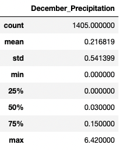

# Hawaii Weather Data Analysis

## Overview
The purpose of this project was to analyze weather data for the island of Oahu in Hawaii in order to inform planning for a prospective surf and ice cream shop business. The current analysis examined weather data for the island during the months of June and December to assess whether conditions would be favorable to the sustainability of the business year-round.

## Results

All analysis for this project was performed using a [SQLite database of weather data for Oahu]( hawaii.sqlite) that was collected from multiple observation stations. A [Python script using Pandas and SQLAlchemy in Jupyter Notebook](SurfsUp_Challenge.ipynb) was developed to query the SQLite database and generate summary statistics for the weather data. 

### Comparison of June and December Temperature Data
The tables below show summary statistics for temperature data for the months of June and December in Oahu. Key differences are:
-    The average temperature for June (about 75 F) is 4 degrees higher than the average temperature for December (about 71 F). The difference between median temperatures for June and December is the same as the difference between average temperatures.
-    It can get cooler in December than in June, with a minimum temperature for December of 56 F, compared with a minimum temperature for June of 64 F.
-    The highs in June and December are similar, with a maximum temperature for June of 85 F and a maximum temperature for December of 83 F.

**June Temperature Data**

**December Temperature Data**

## Summary

Based on the analysis of temperature data for the months of June and December, conditions are similar during both times of the year and would be favorable for a surf and ice cream shop business. In addition to examining temperature data, it would be useful to consider precipitation data. The tables below show summary statistics from additional queries of precipitation data for the months of June and December in Oahu. These data show minimal precipitation during the months of June and December, with median precipitation of 0.02 and 0.03, respectively. Average precipitation for both months is higher than the median due to high outliers that skew the average. Overall, the precipitation data for the months of June and December also support the conclusion that conditions would be favorable for a surf and ice cream shop business.

**June Precipitation Data**

**December Precipitation Data**

